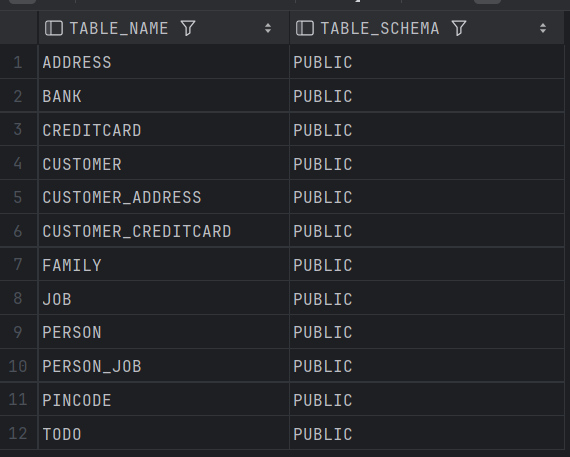

# Assignment 4 - JPA

[](../../actions/workflows/main.yml)

## Table of Content
- [JPA Installation](#jpa-installation)
- [Database inspection](#database-inspection)
- [Pending issues](#pending-issues)

## JPA Installation
I didn't encounter any errors during installation. I got some errors when I tried
to run the program, where I forgot to initialize the Collections which led to NullPointerException.
I also had some problem running the tests because it failed when trying to assert that a
Collection contained a certain item. This is because it was comparing a mutable list with an immutable list. 
I fixed this by changing the test (hope that's okay) by asserting that the ArrayList contained the item.  
  
You can find the code to the project [here](https://github.com/andreashenriksen/dat250-jpa-tutorial).

## Database inspection
I inspected the database by using IntelliJ's plugin called **Database tools and SQL**.
With this I could input SQL queries to view the tables, and I could also use the Database explorer
view that the plugin has to view the content of the database without using queries.  
This is the result when I ran the query to show all tables. 
(Some of the tables are from the tutorial or is the Todo).  

  

Below is the schema for the generated database.
```h2
-- we don't know how to generate root <with-no-name> (class Root) :(

create table ADDRESS
(
NUMBER INTEGER,
ID     BIGINT auto_increment
primary key,
STREET CHARACTER VARYING(255)
);

create table BANK
(
ID   BIGINT auto_increment
primary key,
NAME CHARACTER VARYING(255)
);

create table CUSTOMER
(
ID   BIGINT auto_increment
primary key,
NAME CHARACTER VARYING(255)
);

create table CUSTOMER_ADDRESS
(
ADDRESS_ID  BIGINT not null,
CUSTOMER_ID BIGINT not null,
constraint FK4N1T9CNXHKEV5VDBEDU0AO068
foreign key (ADDRESS_ID) references ADDRESS,
constraint FK7DY564LG4TAC3M50D3WS4MHC4
foreign key (CUSTOMER_ID) references CUSTOMER
);

create table PINCODE
(
COUNT   INTEGER,
ID      BIGINT auto_increment
primary key,
PINCODE CHARACTER VARYING(255)
);

create table CREDITCARD
(
BALANCE     INTEGER,
CREDITLIMIT INTEGER,
NUMBER      INTEGER,
BANK_ID     BIGINT,
ID          BIGINT auto_increment
primary key,
PINCODE_ID  BIGINT,
constraint FKE2WQHNXPKJP87B3EYFQ6GL39A
foreign key (BANK_ID) references BANK,
constraint FKFKY0Y471D7N8CEBC1OE28IDCI
foreign key (PINCODE_ID) references PINCODE
);

create table CUSTOMER_CREDITCARD
(
ADDRESS_ID  BIGINT not null,
CUSTOMER_ID BIGINT not null,
constraint FKFJQ2XYX1JH83R4H1T7F18KXJ
foreign key (CUSTOMER_ID) references CUSTOMER,
constraint FKT3AYXA3H262VHDBAL2BLDRHGT
foreign key (ADDRESS_ID) references CREDITCARD
);
```

## Pending issues
I have not discovered any pending issues with this assignment. 
Everything is running as I expect it to.
